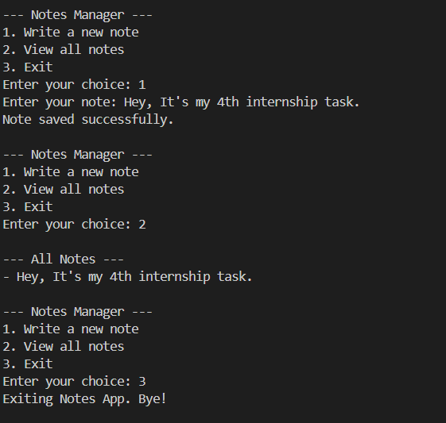

# 📝 Java Notes App – File I/O Mini Project

This is a simple **console-based Notes App** built in **Java** that uses **FileReader** and **FileWriter** to read and write notes from a text file. It's ideal for beginners practicing File I/O, OOP basics, and Java projects.

## 📚 Features

- ✍️ Write notes and save them to a file
- 📖 View all saved notes
- 💾 Uses `FileWriter` to write and `BufferedReader` to read
- 🛠 Simple and clean command-line interface

## 🔧 Tools & Tech

- Java (OOP + File I/O)
- VS Code / IntelliJ / Any IDE
- Terminal / Command Prompt
- Git & GitHub

## 📁 Folder Structure

NotesApp/
├── NotesApp.java 
├── README.md 
├── LICENSE 
├── .gitignore 
├── Img.png 

## 📸 Sample Output

> Output of writing and reading notes:

## 🧪 How to Run

1. **Clone the repository:**

git clone https://github.com/khushbumaurya26/Java-Notes-App.git
cd Java-Notes-App
Compile and run:

javac NotesApp.java
java NotesApp
Use the menu:

1 to write a new note
2 to view all notes
3 to exit the app

📄 Example Interaction

--- Notes Manager ---
1. Write a new note
2. View all notes
3. Exit
Enter your choice: 1
Enter your note: Complete internship task
Note saved successfully.

--- Notes Manager ---
1. Write a new note
2. View all notes
3. Exit
Enter your choice: 2

--- All Notes ---
- Complete internship task
🛡 License
This project is licensed under the MIT License.

🙋‍♀️ Author
Khushbu Maurya
GitHub: @khushbumaurya26

